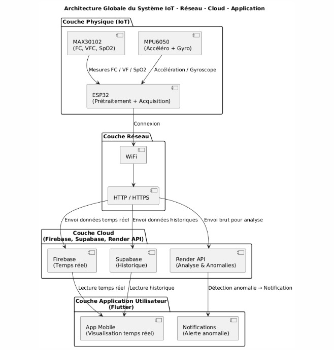
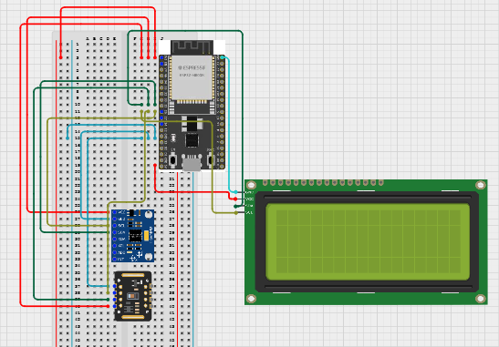

# 🩺 SCAM – Surveillance Contextuelle des Anomalies Cardio-Motrices

SCAM est un système IoT intelligent permettant de surveiller en temps réel les paramètres physiologiques (BPM, SpO₂) et les mouvements (accélération & gyroscope) afin de détecter les anomalies telles que la tachycardie, la bradycardie et les chutes.  
Il combine un ESP32 équipé de capteurs, un backend distribué, une interface Flutter Web déployée sur Netlify, et des services Cloud pour le traitement, l’authentification et la gestion des alertes.

---

## 🚀 Fonctionnalités principales

- Lecture des données physiologiques via capteurs (BPM, SpO₂)  
- Analyse des signaux inertiels (accéléromètre & gyroscope)  
- Détection en temps réel des anomalies cardio-motrices  
- Gestion des alertes et historisation  
- Dashboard Flutter Web affichant :  
  - Courbes BPM / SpO₂  
  - Détection des anomalies  
  - Historique des alertes  
- Authentification sécurisée via Firebase  
- Communication IoT → Cloud via ESP32

---

## 🏗️ Architecture générale

---
## 📡 Schéma IoT du système

Le schéma ci-dessous illustre les connexions entre l’ESP32, les capteurs et l’écran LCD.

### 🔌 Connexions principales
MAX30102 → ESP32 (I2C)

VIN → 3.3V

GND → GND

SCL → GPIO 22

SDA → GPIO 21

MPU6050 → ESP32 (I2C)

VCC → 3.3V

GND → GND

SCL → GPIO 22

SDA → GPIO 21

LCD 16×4 → ESP32 (I2C personnalisé)

SDA → GPIO 25

SCL → GPIO 26

VCC → 5V

GND → GND

## 🛠️ Technologies utilisées

### Frontend
- Flutter Web  
- Déploiement sur Netlify

### Backend / Traitement
- API + traitement Python déployé sur Render

### Cloud et Données
- Firebase Authentication  
- Firebase Realtime Database (données en direct)  
- Supabase (historisation, stockage des alertes)

### Matériel
- ESP32  
- Capteur MAX30102  
- MPU6050 (IMU)

---

## 🔗 Fonctionnement global

1. **ESP32** lit les données BPM, SpO₂, accéléromètre et gyroscope  
2. Il envoie les données vers le **backend Render**, qui applique le traitement , et instantanément dans **Firebase** pour affichage des Dashboards.
3. Render publie les alertes vers **Supabase**.
4. L’interface **Flutter Web (Netlify)** récupère les données et affiche :  
   - Les mesures en temps réel  
   - Les alertes détectées  
   - L’historique des anomalies

Tout le pipeline fonctionne en continu et en temps réel.

---
https://github.com/user-attachments/assets/0490d894-e8a2-4f73-82d4-a3bbb7b8ca40

## ❤️ Équipe

Projet réalisé en collaboration entre les étudiants de **Analytiques des Données & Intelligence Artificielle** et **Master Ingénierie Informatique & Systèmes Distribués**, dans le cadre des modules **Réseaux & IoT** et **Cloud Computing**.

### Master ADIA - Analytiques des données & Intelligence Artificielle
- ELQORACHI Hind  
- KHAIR Latifa  
- KINAD Kawtar

### Master IISE — Ingénierie Informatique & Systèmes Distribués
- EL HEFIANE Meryam
- AHBRI Jihad  
- BABA Farah  

---

## Encadrement / Supervision

Le projet a été encadré par les enseignants responsables des modules respectifs :

-  [Pr. Amine RGHIOUI], [Internet Of Things]
-  [Pr. Monsef BOUGHROUS], [Réseaux/ Cloud Computing]

## 📄 Licence

Projet académique — non destiné à un usage commercial.
**Université Ibn Zohr - Centre d'Excellence IT**
